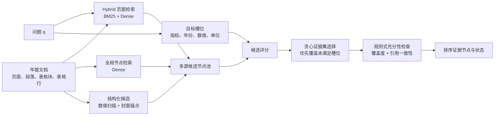

# MMDoc Evidence RAG

> 面向中文年报问答的充分性感知多粒度证据集检索方法

本仓库是小论文 **“面向中文年报问答的充分性感知多粒度证据集检索方法”** 的实验代码与复现记录。研究目标是在**已知问题所属文档**的条件下，从长篇中文年报中定位能够共同支撑回答的页面和细粒度证据节点。

当前版本聚焦证据检索，不包含端到端答案生成、视觉语言模型推理或跨文档检索。

## 方法概览

传统检索通常返回一个相关页面或节点。对于“某公司某年度营业收入是多少”这类财务问题，指标、年份、数值和单位可能分散在段落、表头与表格行中，单一节点命中并不代表证据已充分。

本项目实现的 `Evidence Set Region` 方法包括：



核心设计包括：

- **混合粒度节点**：段落、表格块与表格行共同作为证据候选。
- **多源候选生成**：Hybrid 页面候选、全局 Dense 节点候选、数值扫描和封面锚点并行补充。
- **槽位覆盖选择**：优先选择可补充指标、年份、数值、单位等信息的节点，而非重复选择高相似度片段。
- **规则式充分性评测**：检查返回证据是否覆盖所需信息项，并与人工金标节点进行引用一致性比对。

## 实验结果

### 中文年报冻结测试集

主实验使用按公司划分的冻结数据：12 家公司 / 96 问题用于 train，4 家公司 / 32 问题用于 dev，4 家公司 / 32 问题用于最终 test。

| 方法 | Region Hit@1 | Region Hit@3 | Region Hit@5 | Region MRR | Region nDCG@5 |
| --- | ---: | ---: | ---: | ---: | ---: |
| Page -> Region | 0.0312 | 0.2188 | 0.2500 | 0.1208 | 0.0924 |
| Hybrid-Page -> Region | 0.0312 | 0.1250 | 0.1875 | 0.0885 | 0.0615 |
| Global-Region | 0.0625 | 0.0938 | 0.1250 | 0.0859 | 0.0567 |
| **Evidence Set Region** | **0.4688** | 0.7188 | 0.8750 | 0.6104 | 0.4487 |
| Oracle-Page -> Region | 0.4062 | **0.9688** | **0.9688** | **0.6771** | **0.6390** |

以每题前 3 个返回节点重评测时，完整方法的规则式 `Sufficiency Rate` 为 `0.6875`，`Required Item Coverage` 为 `0.9453`。移除数值扫描后，充分率降至 `0.5000`；移除槽位覆盖后，Region Hit@3 虽升至 `0.9375`，充分率却降至 `0.3438`。这说明“命中一个金标节点”与“证据足以共同支撑回答”是不同目标。

> `Hybrid-page` 与 `Global-region` 在冻结 test 上没有表现出稳定增益，因此不应将它们单独描述为已被最终测试验证的确定贡献。详细讨论见 [docs/paper/12_discussion_and_limitations_draft.md](docs/paper/12_discussion_and_limitations_draft.md)。

### MMDocIR 外部验证

在 MMDocIR Evaluation 的 313 篇文档、1,658 个问题上，检索范围同样限制在已知所属文档内。

| 方法 | Page R@1 | Page R@5 | Page R@10 | Page MRR | Page nDCG@5 |
| --- | ---: | ---: | ---: | ---: | ---: |
| BM25-page | **0.4903** | 0.7521 | 0.8456 | 0.6084 | 0.6060 |
| Dense-page (BGE-M3) | 0.4451 | 0.7304 | 0.8263 | 0.5732 | 0.5708 |
| Hybrid-page (BM25 + BGE-M3) | 0.4879 | **0.7600** | **0.8727** | **0.6143** | **0.6083** |

Dense 布局节点检索在 1,598 个具有精确布局金标的问题上得到 `Region Hit@5 = 0.5044`。文本类问题的节点定位优于图表类问题（`0.7377` vs. `0.3259`），因此本项目不将当前结果解释为通用视觉问答能力。

## 快速开始

### 1. 创建环境

本项目要求 Python `>=3.11,<3.13`，使用 [uv](https://docs.astral.sh/uv/) 管理环境：

```bash
uv python install 3.11
uv sync --dev
```

验证命令行入口：

```bash
uv run mdr --help
```

### 2. 运行内置 Demo

无需真实数据即可验证数据准备、检索和评测流程：

```bash
uv run mdr prepare --dataset demo
uv run mdr retrieve --config configs/experiments/demo_page_region.yaml
uv run mdr evaluate --run runs/retrieval/demo_page_region/latest
```

### 3. 运行中文年报完整方法

中文年报 Dense 实验需要本地可用的 `BAAI/bge-small-zh-v1.5` 模型，并使用已冻结的公司级 test 划分：

```bash
HF_HOME=artifacts/hf_cache UV_CACHE_DIR=.uv-cache \
uv run mdr retrieve --config configs/experiments/cn_evidence_set_region.yaml

UV_CACHE_DIR=.uv-cache \
uv run mdr evaluate --run runs/retrieval/cn_evidence_set_region/test/latest
```

在 dev 集验证或选择配置时显式指定 `--split dev`，不要根据 test 输出修改候选来源、权重、Top-K 或选择策略。

### 4. 运行 MMDocIR 页面检索

将官方数据放在项目外部目录，并通过环境变量指定其位置：

```bash
MMDOCIR_EVALUATION_ROOT=/path/to/MMDocIR_Evaluation_Dataset \
uv run mdr prepare --dataset mmdocir_evaluation

HF_HOME=artifacts/hf_cache UV_CACHE_DIR=.uv-cache \
uv run mdr retrieve --config configs/experiments/mmdocir_hybrid_page_bge_m3.yaml

UV_CACHE_DIR=.uv-cache \
uv run mdr evaluate --run runs/retrieval/mmdocir_hybrid_page_bge_m3/latest
```

Windows + CUDA 环境中，如果 `uv.lock` 固定的是 CPU 版 PyTorch，请使用已安装 GPU PyTorch 的活动环境运行：

```powershell
$env:HF_HOME = "artifacts\hf_cache"
$env:MDR_DENSE_DEVICE = "cuda"
uv run --no-sync mdr retrieve --config configs/experiments/mmdocir_hybrid_page_bge_m3.yaml
```

完整命令、输出解释与故障处理见 [docs/run_project/01_run_command.md](docs/run_project/01_run_command.md)。

## 数据与目录

```text
configs/                         实验配置与公司级数据划分
data/raw/cn_annual_reports/      中文年报 PDF 与人工修订 QA 标注
data/raw/mmdocir/                MMDocIR 原始数据（可使用外部路径）
data/processed/{dataset}/        标准化 documents/pages/nodes/queries 数据
src/mmdocrag/                    数据适配、检索、评测与命令行实现
tests/                           单元测试与 smoke tests
docs/paper/                      实验协议、结果和论文写作草稿
docs/run_project/                运行、Git 与复现实验说明
runs/                            本地实验输出（不提交 Git）
artifacts/                       本地模型缓存与可再生成产物（不提交 Git）
```

原始数据、模型缓存和 `runs/` 不应提交到 Git。正式实验应保留对应运行目录的 `config.json`、`run_info.json`、`metrics.json` 与预测文件，以便复核。

## 研究边界

本仓库当前可以声明的能力：

- 已知所属文档条件下的文档内页面和证据节点检索。
- 段落、表格块、表格行的混合粒度候选生成与证据集选择。
- 中文年报上的公司级冻结划分、节点检索和规则式充分性评测。
- MMDocIR 上的页面与布局节点检索外部验证。

当前不应声明的能力：

- 通用多模态视觉问答、图表语义理解或图像 embedding/VLM 推理。
- 端到端答案正确率、幻觉抑制、引用生成或拒答能力。
- 跨文档检索、人工充分性评测或统计显著性结论。

## 论文材料与复现记录

- [实验协议](docs/paper/01_experiment_protocol.md)
- [方法草稿](docs/paper/08_method_draft.md)
- [实验与结果](docs/paper/11_experiments_and_results_draft.md)
- [讨论与局限性](docs/paper/12_discussion_and_limitations_draft.md)
- [结论](docs/paper/13_conclusion_draft.md)

## 项目研究 Skill

本项目包含专用研究 skill：[skills/mmdoc-evidence-research/SKILL.md](skills/mmdoc-evidence-research/SKILL.md)。它用于帮助支持 Codex skill 的模型在代码分析、实验设计和论文写作时遵守本项目的研究边界；它不是检索模型，也不需要单独启动服务。

## 引用

若使用本仓库的代码、实验协议或中文年报标注，请在论文定稿后替换为正式发表信息。当前可使用如下占位条目：

```bibtex
@misc{zhouwenjing2026evidencesetregion,
  title  = {Sufficiency-Aware Multi-Granularity Evidence Set Retrieval for Chinese Annual Report Question Answering},
  author = {Zhou, Wenjing},
  year   = {2026},
  note   = {Project repository and experimental materials}
}
```

## License

本仓库代码沿用原项目许可证。原始年报、人工标注、模型与 MMDocIR 数据集应分别遵守其数据来源和许可证要求。
